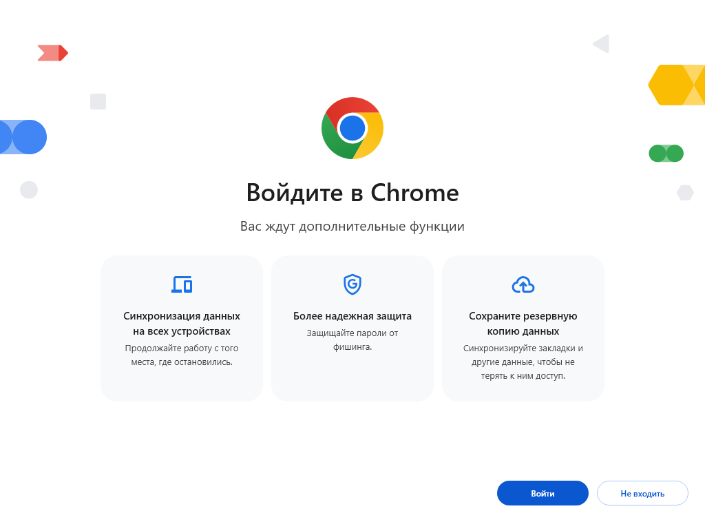

<div align="center">

# 📊 Выгрузка оценок из МЭШ


Автоматический сбор всех оценок из электронного дневника **school.mos.ru (МЭШ)**  
в файл Excel с удобной сводкой по оценкам.

</div>

---

## ✨ Возможности

- 🔥 **Самостоятельно запускает Chrome** — ничего настраивать не нужно
- 🔑 **Автоматически подхватывает авторизацию** — дождитесь входа в МЭШ
- 👨‍👩‍👧‍👦 **Поддержка нескольких детей** — собирает оценки всех сразу
- 📋 **Сводная таблица** — сколько каких оценок по каждому предмету
- 🔍 **Автофильтр** — можно сортировать, фильтровать, искать
- 🧹 **Сам закрывает Chrome** после завершения

## 🚀 Быстрый старт

**1. Скачайте программу**

▶️ [Скачать последнюю версию](https://github.com/maxinteresa-ops/dnevnik-mesh-export/releases/latest)

**2. Запустите**

Просто дважды кликните `dnevnik-mesh-export.exe`. Программа сама:
- Запустит Chrome со страницей МЭШ
- Будет ждать вашего входа в аккаунт
- Как только вы авторизуетесь — начнёт сбор

**3. Дождитесь результата**

После сбора всех оценок программа закроет Chrome и покажет статистику.  
Файл `grades.xlsx` появится рядом с программой.

**Сколько ждать?** Обычно 10 секунд на сбор всех 38 учебных недель.

## 👨‍👩‍👧‍👦 Для родителей с несколькими детьми

Программа сама определяет всех детей из вашего профиля МЭШ.  
В файл `grades.xlsx` попадут оценки всех детей, в колонке «Ребёнок» указано имя.

## 📁 Что создаётся в папке

| Файл / Папка | Назначение |
|---|---|
| `grades.xlsx` | **Результат** — таблица с оценками + сводка |
| `chrome-profile/` | Профиль Chrome (создаётся при первом запуске) |
| `dnevnik-mesh-export_*.log` | Лог ошибок (если что-то пошло не так) |

## ❓ Частые вопросы

<details>
<summary><strong>Где найти лог-файл и как отправить его разработчику?</strong></summary>

В папке с программой после ошибки создаётся файл `dnevnik-mesh-export_*.log`. Откройте его в блокноте и приложите к [Issues на GitHub](https://github.com/maxinteresa-ops/dnevnik-mesh-export/issues/new) — это поможет быстро разобраться.
</details>

<details>
<summary><strong>Chrome не установлен, а программа говорит «Chrome не найден»</strong></summary>

Установите Google Chrome. Другие браузеры (Firefox, Edge, Яндекс.Браузер) не поддерживаются.
</details>

<details>
<summary><strong>Ничего не происходит после запуска</strong></summary>

Проверьте что Chrome не запущен (закройте все окна) и запустите заново. При первом запуске Chrome создаёт профиль — это нормально.
</details>

<details>
<summary><strong>Как удалить профиль Chrome?</strong></summary>

Если нужно начать с чистого листа — удалите папку `chrome-profile/` рядом с программой. Она создастся заново при следующем запуске.
</details>

<details>
<summary><strong>Chrome просит войти в аккаунт при первом запуске</strong></summary>

Нажмите **«Продолжить без входа»** — аккаунт Google не нужен, программа работает без него:

<a href="first-run-dialog.png" target="_blank"></a>
</details>

## 🛠 Сборка из исходников

```bash
pip install openpyxl websocket-client pyinstaller
pyinstaller --onefile --console --distpath . --name dnevnik-mesh-export dnevnik-mesh-export.py
```

## 📄 Лицензия

**CC BY-NC-SA 4.0** (Creative Commons Attribution-NonCommercial-ShareAlike)

| Разрешено | Запрещено |
|---|---|
| Скачивать и запускать | Коммерческое использование |
| Делиться с другими | Встраивать в платные продукты |
| Модифицировать код | Менять лицензию производных работ |
| Использовать в личных и образовательных целях | Использовать торговую марку автора |

Полный текст: [LICENSE](LICENSE)
